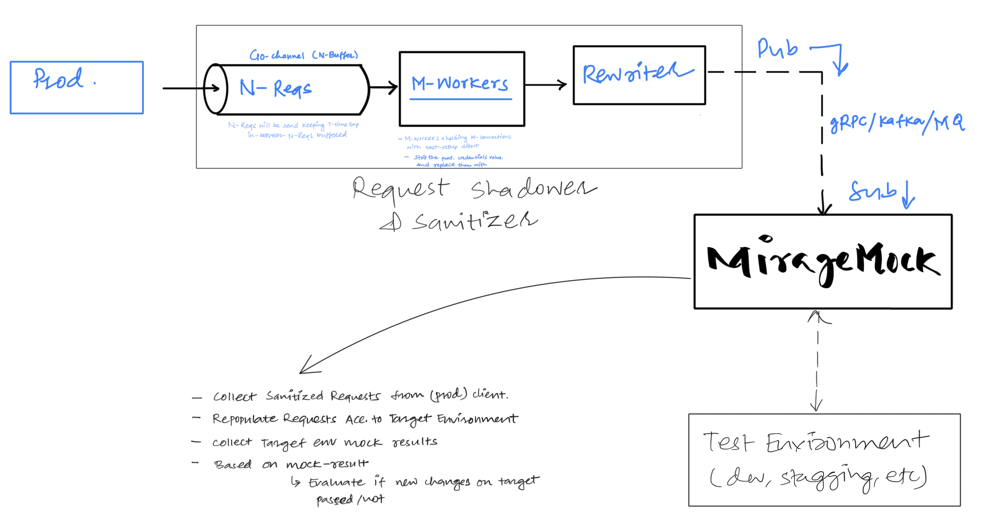
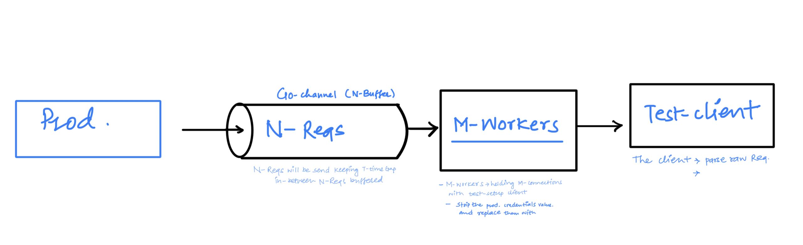

# Mirage Mock : Test Architecture

**Mirage Mock** is a layer-7 test architecture that shadows (copies) live production traffic, surgically sanitizes sensitive data via high-speed byte-boundary shifting, and replays real-world concurrent loads against test environments.

# Objectives
- Reverse Testing: test the working enviornment (dev, staging) by real-production requests

# System Working Flow
```text
(Real-World Production System | Mirage Mock implemented) ----> copy and rewrite incoming requests ---> MirageMock Service ---> Target Test Environment (dev, staging, etc) 
```

# Architecture

2. Second Phase Architecture
   

1. First Phase Architecture
   
